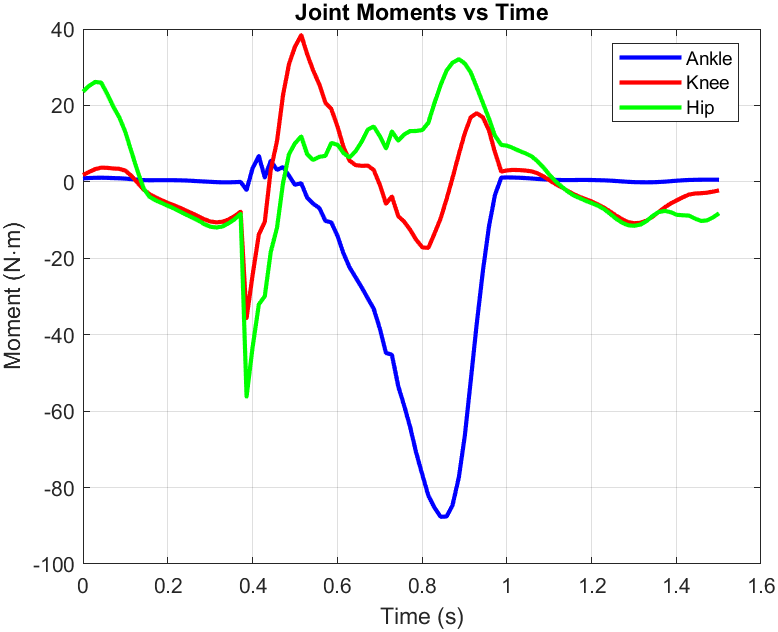
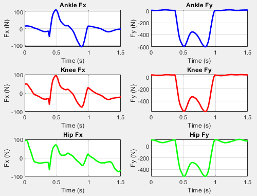

# 2D Inverse Dynamics Gait Analysis
 
Estimating the **net joint moments** and **intersegmental reaction forces** at the ankle, knee, and hip during a human gait cycle, from planar motion-capture markers and force-plate data, using a recursive Newton–Euler inverse-dynamics formulation in MATLAB.
 

 
---
 
## Overview
 
When a person walks, we can measure where their joints are (with reflective markers placed over bony landmarks, which move the least relative to the skeleton) and how hard the ground pushes back (with a force plate). What we *can't* directly measure are the internal torques the muscles and joints generate to produce that motion. **Inverse dynamics** recovers those internal loads from the measured kinematics and ground reaction forces.
 
This project implements a 2D (sagittal-plane) inverse-dynamics pipeline for a single leg through one gait cycle. Given marker trajectories for the hip, knee, fibula, ankle, and metatarsal head, plus ground reaction force and center-of-pressure data, it computes the time history of:
 
- net **moment** at the ankle, knee, and hip, and
- the **reaction force** transmitted across each joint.
The subject is modeled as three rigid segments — **foot, shank (leg), and thigh**. The segment lengths and the subject's total body mass ($M = 56.7\,\text{kg}$) are specific to the individual, while the segment mass fractions, center-of-mass locations, and radii of gyration are taken from Winter's standard anthropometric tables (*Biomechanics and Motor Control of Human Movement*). Each segment's moment of inertia is computed as $I = m k^2$, where $k$ is the radius of gyration scaled by segment length.
 
## Method
 
The analysis proceeds **distal to proximal** (foot → shank → thigh). Each segment is treated as a rigid body, and Newton–Euler equations are solved at every time frame:
 
$$\sum \vec{F} = m\,\vec{a}_{\text{com}}, \qquad \sum M_{\text{com}} = I\,\alpha$$
 
For each segment the pipeline:
 
1. **Builds segment geometry** — computes the segment orientation from its two markers via `atan2`, and locates the center of mass along the segment using anthropometric fractions of its length.
2. **Differentiates kinematics** — applies central finite differences to obtain linear and angular velocities and accelerations of each segment's center of mass.
3. **Applies the equations of motion** — solves the force balance for the proximal joint reaction force, then the moment balance about the center of mass for the net joint moment.
4. **Passes loads upward** — by Newton's third law, the reaction force and moment at the proximal joint of one segment become the (sign-reversed) known distal loads of the next segment up the chain. The ground reaction force enters at the foot as the only externally measured load.
One modeling detail is specific to the shank: its **orientation** is defined by the vector from the ankle to the head of the fibula, but its **length and center-of-mass position** are referenced to the ankle–lateral-epicondyle (knee) line. This follows the convention that the fibula head gives a cleaner direction vector while the segment is anatomically defined ankle-to-knee.
 
Marker noise is amplified by differentiation, so a centered moving-average filter is applied to the raw coordinates and again after each derivative to keep the acceleration estimates usable.
 
## Results
 
**Net joint moments.** The ankle shows the characteristic large moment that builds through the "push-off" that propels the body forward and is the largest joint moment in the cycle. The knee and hip moments are smaller and reverse sign across the cycle, reflecting the alternating flexion/extension demands of swing and stance.


**Intersegmental reaction forces.** The vertical components ($F_y$) at all three joints reproduce the classic **double-bump (M-shaped) loading pattern** of walking: a peak at weight acceptance and a second at push-off, with a dip during midstance. The horizontal components ($F_x$) reverse sign through stance, consistent with the shift from braking in early stance to propulsion at push-off.




## Repository structure

```
.
├── src/
│   ├── Project2_Gait_Analysis_Peter_Z.m   # main inverse-dynamics pipeline (run this first)         
├── data/
│   └── Project2Data.mat  # marker + force-plate data (106 frames, ~70 Hz)
├── results/              # figures rendered from the analysis
└── README.md
```

## How to run

Requirements: **MATLAB** (developed and tested on a recent release; no add-on toolboxes required — `movmean` and `unwrap` are in base MATLAB).

```matlab
run('Project2_Gait_Analysis_Peter_Z.m')   % computes loads and produces the moment/force plots
```

`Project2_Gait_Analysis_Peter_Z.m` loads the data if the data is in the scripts current directory. So, in order to get the script to work the data needs to in the same directory as the downloaded script.

##Data

Project2Data.mat contains two matrices:
 
  - MarkerData — 106 frames × 18 columns: frame index, time stamp, and the $(x, y)$ coordinates (meters) of the hip, knee, fibula, ankle, and metatarsal markers. The remaining columns are unused by this analysis.
  - ForceData — force-plate measurements for the same frames: the horizontal and vertical ground reaction force components and the center of pressure.

The trial spans ~1.5 s sampled at roughly 70 Hz.

## Modeling assumptions & limitations

- **Planar (2D) analysis** — motion is assumed to lie in the sagittal plane; out-of-plane rotation is ignored.
- **Rigid segments** — segment lengths and total body mass are subject-specific, but the mass fractions, COM locations, and radii of gyration are population averages from Winter's tables.
- **Joint loads reduced to a force–moment pair** — individual muscle forces are not resolved; each joint is represented by a single net reaction force and net moment. Soft-tissue energy loss is neglected.
- **Finite-difference differentiation** of noisy marker data. Position, velocity, and acceleration are all smoothed with a moving average; this suppresses differentiation noise but can also attenuate true peak magnitudes, so reported extrema are somewhat conservative. The smoothing window is a tunable parameter.
- A single force plate is assumed to capture the full ground reaction for the analyzed limb.

## Author

Peter Ziegler
